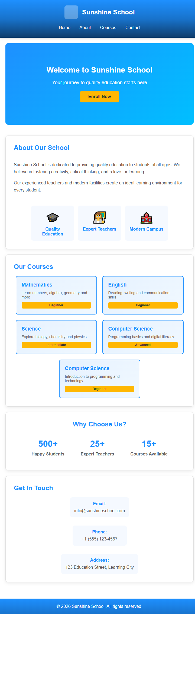

# 🌐 Sunshine School Landing Page

This is a modern and responsive **School Landing Page** built using HTML and CSS. It is designed to present a school's information in a clean, structured, and visually appealing layout.

## 🚀 Features
- Responsive design for mobile, tablet, and desktop
- Clean and modern user interface
- Navigation bar with smooth layout
- Attractive banner (hero section)
- About section with features
- Courses section with styled cards
- Statistics section (students, teachers, courses)
- Contact information section
- Styled footer

## 🛠️ Technologies Used
- HTML5
- CSS3 (Flexbox & Responsive Design)

## 📂 Sections Included
- Header & Navigation
- Banner / Hero Section
- About Section
- Courses Section
- Statistics Section
- Contact Section
- Footer

## 🎯 Purpose of Project
This project was created to practice front-end development skills, including layout design, responsive design, and UI structuring using HTML and CSS.

## 📸 Preview

## 🔗 GitHub Repository
Add your repo link here:
https://github.com/your-username/your-repo-name

## ▶️ How to Run
1. Download or clone the repository
2. Open the project folder
3. Open `index.html` in any browser

---

✨ Developed as part of my web development learning journey.
